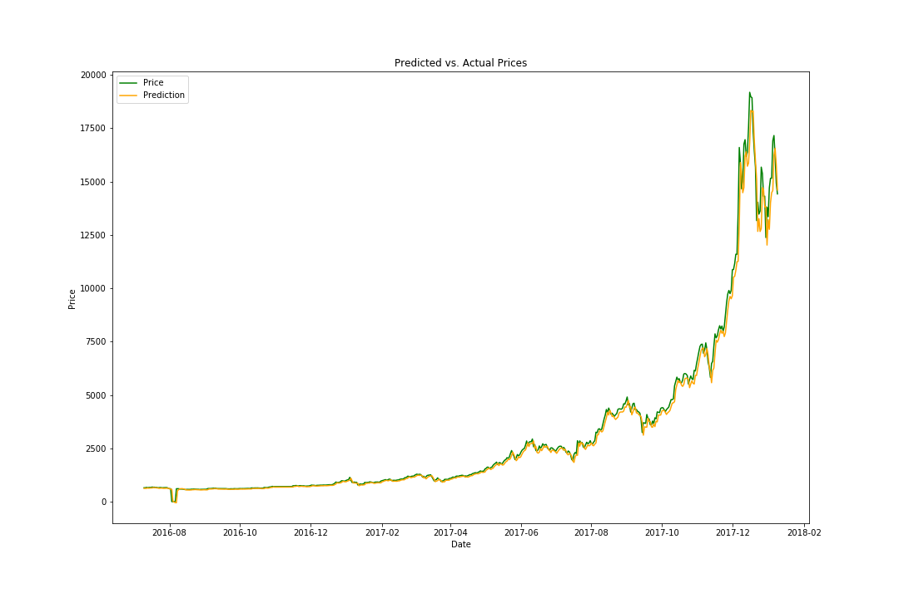

# CryptocurrencyML

In this repository, I trained recurrent neural networks with LSTMs to forecast the prices of cryptocurrencies for the 
next day given the prices for the previous days.

## BitCoin

### Historical Price Data

### Test Predictions

## DogeCoin

### Historical Price Data

### Test Predictions

## Ethereum

### Historical Price Data

### Test Predictions

## LiteCoin

### Historical Price Data

### Test Predictions

## Ripple

### Historical Price Data

### Test Predictions

